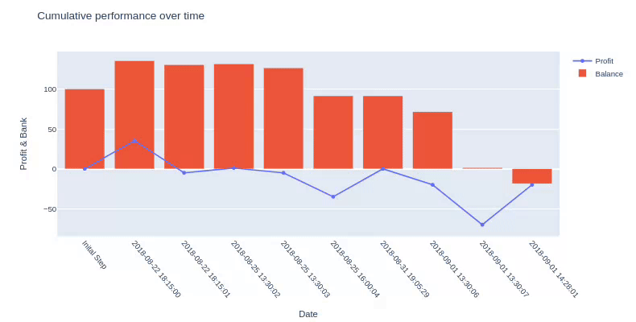
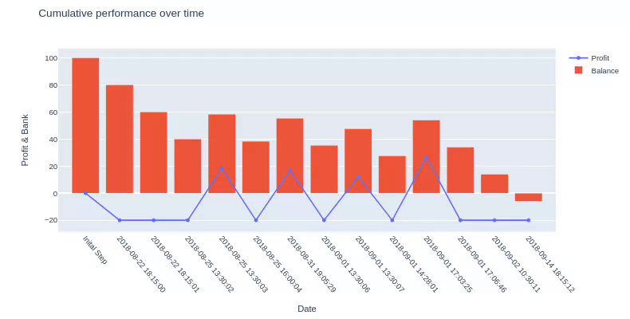

`fastbet`
================

<!-- WARNING: THIS FILE WAS AUTOGENERATED! DO NOT EDIT! -->

``` python
from IPython.display import HTML

import pandas as pd

from fastbet.config.localconfig import CONFIG, DB_HOSTS
from fastbet.config.mongo import mongo_init
from fastbet.datastructure.data_extractor import data_aggregator
from fastbet.environment import BettingEnv
```

## Install

``` sh
pip install fastbet
```

## Config

In order to connect to the `mongo` database we require some connection
parameters defined in `toml` format and should be read when the library
is loaded. The package will look first under `/secrets/config.toml` or
in the environment variable `BETTING_ENV_CONFIG`. An example of `config`
file is provided with the package and will be used by default. It is the
user’s responsibility to make sure this file is saved at the right
location if you want to use your own.

Let’s start by registering the connection to the mongo database:

``` python
mongo_init(db_host="public_atlas")
```

## Simplified betting environment

The punter starts with `$N` (N\>0) in his Bank account and can use them
to place bets on several `football` games.

He is offered the option to bet on the 2 main markets: `1X2`
(home/draw/away) and `Asian handicap` (we focus on the even line) and is
only allowed to place a `small`, `medium`, or `big` stake on *one and
only one* of the 5 possible selections `home team win`, `away team win`,
or `draw` (`1X2` case) or `home` or `away` (`Asian handicap`) or skip
the betting opportunity. At each step, the punter is presented with some
information about a game and the associated betting opportunities. If he
decides to bet, he receives a *reward* that could be `positive` (profit)
or `negative` (loss of his stake). His balance is then updated
accordingly and he moves to the next step i.e next game. An episode ends
when the punter goes bankrupt (Balance \<= 0) or if no more betting
opportunities are available.

### Load games

``` python
fixtures = data_aggregator(limit=10)
```

### Init environment

``` python
env = BettingEnv(fixtures)
max_steps_limit = fixtures.shape[0]
```

### Playing random choices

``` python
# Init RL env.
env.reset()

# Init done Flag to False.
done = False
# Init loop counter.
i = 0
# Stops when it is done or when we have bet on all provided games.
while not done and i < max_steps_limit:
    # Make a step.
    obs, reward, done, info = env.step(env.action_space.sample())
    # Increment counter.
    i = i + 1
```



### Playing Medium Stake on Home Team Win (1X2)

``` python
# Init RL env.
env.reset()
# Init done Flag to False.
done = False
# Init loop counter.
i = 0
# Stops when it is done or when we have bet on all provided games.
while not done and i < max_steps_limit:
    # Make a step.
    obs, reward, done, info = env.step(2)
    # Increment counter.
    i = i + 1
```


